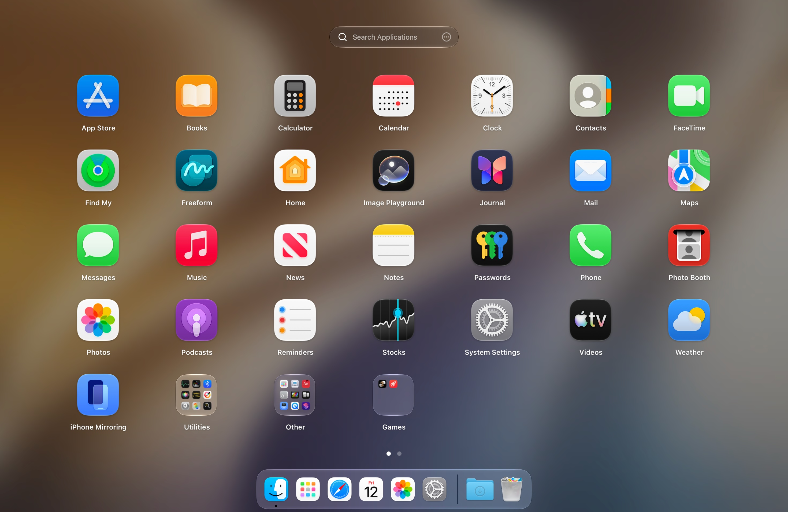

  
  <h1>LaunchOS</h1>

  

    
    
    
  

  <h3 align="center">LaunchOS – la meilleure alternative à Launchpad pour macOS 26 et macOS 27</h3>

  

    <!-- launchos-version:start -->
    
v2.3.1 &nbsp; - &nbsp; Sep 15, 2026

    <!-- launchos-version:end -->
  

  

    
  

[English](./README.md) | [简体中文](./README_CN.md) | [繁體中文](./README_TW.md) | [日本語](./README_JA.md) | [Deutsch](./README_DE.md) | Français

[LaunchOS](https://launchosapp.com/?utm_source=github&utm_medium=readme) redonne à macOS 26 et macOS 27 l’expérience familière de Launchpad. Une petite installation suffit pour retrouver une grille d’applications que vous pouvez parcourir et organiser comme avant. Les gestes et les habitudes restent naturels, avec des améliorations pratiques en plus. L’application est légère, fluide et s’intègre au style Liquid Glass du système.

Nous avons soigné les détails qui comptent au quotidien et ajouté des fonctions utiles que le Launchpad d’origine ne proposait pas.

<h2 align="center">Fonctionnalités de LaunchOS</h2>

Conçu avec soin, jusque dans les détails

<table>
  <tr>
    <td align="center" width="25%">
       
      <strong>L’expérience native de Launchpad</strong>
    </td>
    <td align="center" width="25%">
       
      <strong>Parfaitement intégré à Liquid Glass</strong>
    </td>
    <td align="center" width="25%">
       
      <strong>Construit nativement, fluide et rapide</strong>
    </td>
    <td align="center" width="25%">
       
      <strong>Prise en charge du taux de rafraîchissement de 120 Hz</strong>
    </td>
  </tr>
  <tr>
    <td align="center" width="25%">
       
      <strong>Importer la mise en page native Launchpad</strong>
    </td>
    <td align="center" width="25%">
       
      <strong>Menu rapide par clic droit</strong>
    </td>
    <td align="center" width="25%">
       
      <strong>Ouvrir avec un raccourci global</strong>
    </td>
    <td align="center" width="25%">
       
      <strong>Glissez des apps vers votre Dock</strong>
    </td>
  </tr>
  <tr>
    <td align="center">
       
      <strong>Lancer avec le geste du trackpad</strong> 
      <code>PRO</code>
    </td>
    <td align="center">
       
      <strong>Ouvrir depuis les coins actifs</strong> 
      <code>PRO</code>
    </td>
    <td align="center">
       
      <strong>Ouvrir avec la touche F4</strong> 
      <code>PRO</code>
    </td>
    <td align="center">
       
      <strong>Disposition de grille personnalisable</strong> 
      <code>PRO</code>
    </td>
  </tr>
  <tr>
    <td align="center">
       
      <strong>Vue à défilement vertical</strong> 
      <code>PRO</code>
    </td>
    <td align="center">
       
      <strong>Désinstaller complètement les applications</strong> 
      <code>PRO</code>
    </td>
    <td align="center">
       
      <strong>Mode de navigation dans la fenêtre</strong> 
      <code>PRO</code>
    </td>
    <td align="center">
       
      <strong>Sélection multiple et actions groupées</strong> 
      <code>PRO</code>
    </td>
  </tr>
  <tr>
    <td align="center">
       
      <strong>Renommer une application personnalisée</strong> 
      <code>PRO</code>
    </td>
    <td align="center">
       
      <strong>Masquer les applications indésirables</strong> 
      <code>PRO</code>
    </td>
    <td align="center">
       
      <strong>Sources d'applications personnalisées</strong> 
      <code>PRO</code>
    </td>
    <td align="center">
       
      <strong>Réorganiser la disposition</strong> 
      <code>PRO</code>
    </td>
  </tr>
</table>

## Principales nouveautés de LaunchOS V2

- LaunchOS V2 a été reconstruit de zéro et est passé de SwiftUI à AppKit.
- Le premier lancement après le démarrage, les performances et les animations ont été nettement améliorés.
- Les écrans à 120 Hz et plus sont pris en charge nativement.

V2 est plus rapide, plus fluide et plus économe en énergie comme en mémoire.

## FAQ

**Que dois-je faire si je n'ai pas reçu l'e-mail de licence ?**

Après le paiement, vous recevrez un reçu et un e-mail de licence distinct, parfois avec quelques minutes de décalage. Vérifiez aussi vos courriers indésirables. Si aucun message n’arrive, contrôlez l’adresse indiquée lors de l’achat et contactez-nous à l’adresse ci-dessous.

**Que se passe-t-il si l'activation échoue ou s'il y a une erreur réseau ?**

Vérifiez la connexion Internet du Mac. Quittez temporairement votre proxy, pare-feu ou outil de sécurité, ou autorisez LaunchOS à accéder au réseau. Essayez ensuite un autre réseau, par exemple le partage de connexion d’un téléphone. Si l’erreur persiste, contactez-nous.

**Comment utiliser ma licence sur un nouvel appareil ?**

Si vous avez encore l’ancien appareil, retirez-le dans Réglages → À propos → Gestion des appareils avant d’activer le nouveau. Sinon, commencez l’activation sur le nouveau Mac et utilisez Gestion des appareils dans la boîte de dialogue pour retirer l’ancien.

**Pourquoi LaunchOS n’est-il pas disponible sur l’App Store ?**

Les règles de l’App Store rendent difficile la publication d’une application qui reproduit une fonction système native. LaunchOS est donc distribué directement. Les paiements sont traités par Paddle ; nous n’utilisons que l’adresse e-mail nécessaire à la gestion de la licence.

**Existe-t-il un essai gratuit ?**

Oui. LaunchOS propose une formule Basic gratuite et un essai PRO de sept jours. À la fin de l’essai, vous pouvez activer PRO ou continuer avec Basic.

## Nous contacter

**launchos@remixdesign.app**

LaunchOS n’est pas un produit open source et ne repose pas sur un lanceur open source existant.

Ce dépôt sert uniquement à présenter le produit et à recueillir les Issues.
